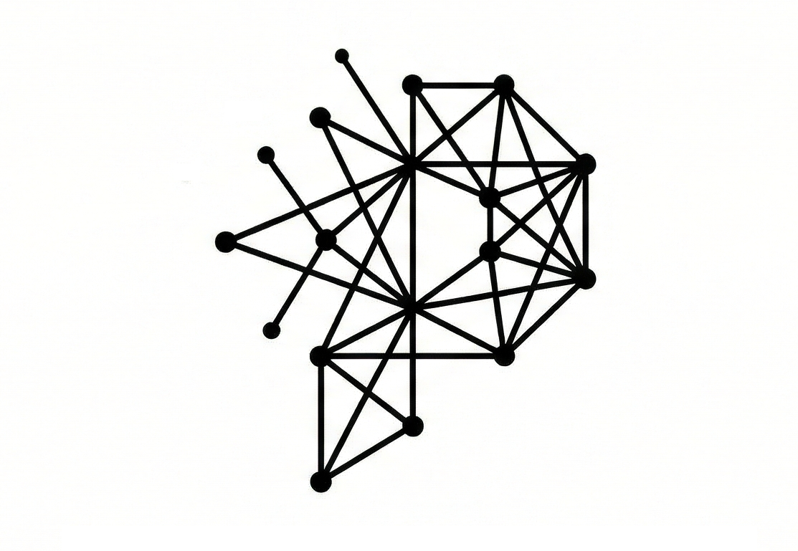

<p align="center">
  
</p>

<h1 align="center">Paradigm</h1>

<p align="center">
  <a href="https://opensource.org/licenses/MIT"></a>
  <a href="https://nodejs.org/"></a>
</p>

<p align="center"><strong>Structure for AI-Native Development</strong></p>

<p align="center"><em>A language-agnostic meta-framework that gives AI agents structured context to navigate, understand, and modify any codebase — 8.5x fewer tokens, 88% lower cost.</em></p>

Paradigm is a developer tools ecosystem that brings **structured context**, **authorization topology**, and **on-demand intelligence** to modern software projects — designed for both human developers and AI agents. It works with **any language** (TypeScript, Python, Rust, Go, Swift, Kotlin, etc.), **any AI tool** (Claude Code, Cursor, Copilot, Claude Desktop), and **any framework** via 14 auto-detected disciplines and 16 stack presets.

## The Problem

Modern development has a context problem:

- **Context evaporates** — What does this feature do? What auth does it need? AI doesn't know. New team members don't know. Sometimes YOU don't know.
- **Authorization is a black box** — Who can access what? It's buried in middleware, scattered across files, impossible to visualize.
- **AI agents work blind** — Your AI assistant reads thousands of tokens but misses the forest for the trees.

## The Solution

Three pillars, one ecosystem:

| Pillar | What It Does |
|--------|--------------|
| **Purpose** | Define what things are and why they exist (`.purpose` files) |
| **Portal** | Define who can access what, under what conditions (`portal.yaml`) |
| **Premise** | Aggregate everything into a queryable knowledge graph |

Plus tooling that makes it all work:

| Tool | What It Does |
|------|--------------|
| **MCP Server** | 50+ tools for AI agents to query context on-demand (~100 tokens vs ~2000 per query) |
| **Sentinel** | Incident tracking, failure patterns, symbol-correlated observability |
| **University** | Interactive courses and PLSAT certification exam |
| **Multi-Agent Orchestration** | Coordinate architect, builder, reviewer, tester, and security agents |

## Measured Results

We built the same project management API twice — once with traditional docs, once with Paradigm. Same features, same AI agent, same prompts.

| Metric | Traditional | Paradigm | Difference |
|--------|-------------|----------|------------|
| **Time to complete** | ~12 minutes | ~7 minutes | **42% faster** |
| **Context per task** | ~14,000 tokens | ~1,500 tokens | **8.5x less** |
| **Token cost** | $0.50/task | $0.06/task | **88% cheaper** |
| **Auth gates documented** | 0% | 100% | — |

**Why?** Structured context beats raw context. A 50-line `.purpose` file declaring signals and dependencies beats a 500-line source file that buries them in implementation details.

[Full study →](.paradigm/docs/agentic-efficiency-study.md)

---

## Symbol System

Five symbols create a shared language between code, developers, and AI:

| Symbol | Name | Example | Meaning |
|--------|------|---------|---------|
| `#` | Component | `#checkout`, `#Button` | Any documented code unit |
| `$` | Flow | `$checkout-flow` | Multi-step process |
| `^` | Gate | `^authenticated` | Authorization checkpoint |
| `!` | Signal | `!login-failed` | Event or side effect |
| `~` | Aspect | `~audit-required` | Cross-cutting rule with code anchor |

Classification uses **tags** instead of extra prefixes: `[feature]`, `[integration]`, `[state]`, `[idea]`, etc.

These symbols work everywhere — code comments, commit messages, documentation, AI prompts, and visual tools.

---

## Installation

### Quick Install (Recommended)

```bash
curl -fsSL https://a-company.org/paradigm/install.sh | bash
```

This clones to `~/.paradigm-cli/`, builds, and installs the `paradigm` and `paradigm-mcp` CLIs globally. Re-running the same command updates to the latest version.

Or download and inspect first:

```bash
curl -fsSL https://a-company.org/paradigm/install.sh -o install.sh
chmod +x install.sh
./install.sh
```

> **Note:** The source directory at `~/.paradigm-cli/` must be kept — the global CLIs symlink to it. To uninstall: `npm uninstall -g @a-company/paradigm @a-company/paradigm-mcp && rm -rf ~/.paradigm-cli`

### Manual Install

```bash
# 1. Clone and build (keep this directory — CLIs symlink to it)
git clone https://github.com/ascend42/a-paradigm.git ~/.paradigm-cli
cd ~/.paradigm-cli
npm install && npm run build

# 2. Install CLI globally
cd packages/paradigm && npm install -g . && cd ../..

# 3. Install MCP server globally
cd packages/paradigm-mcp && npm install -g . && cd ../..

# 4. Verify
paradigm --version
```

> **Note:** Paradigm is not yet published to npm. Install from source using the methods above. npm registry publishing is planned.

---

## Quick Start

### One Command Setup

```bash
paradigm init --quick && paradigm sync --all && paradigm mcp setup --client all && paradigm constellation && paradigm beacon && paradigm doctor
```

This initializes config, generates IDE files, configures MCP, builds the symbol graph, creates AI orientation, and verifies everything.

### Step-by-Step

```bash
# 1. Initialize configuration
paradigm init --quick

# 2. Generate IDE instruction files
paradigm sync --all

# 3. Configure MCP for AI tools
paradigm mcp setup --client all

# 4. Generate symbol graph and orientation
paradigm constellation
paradigm beacon

# 5. Verify setup
paradigm doctor
```

### Minimal Start

You don't need everything. Start small:

```bash
paradigm init
# Edit src/features/.purpose (or wherever your features live)
paradigm beacon
```

Your AI assistant reads `beacon.md` for instant context. Add `portal.yaml`, MCP, and more as needed.

---

## What Gets Created

```
your-project/
├── .paradigm/              # Configuration & specs
│   ├── config.yaml         # Main configuration
│   ├── specs/              # Logger, symbols, context specs
│   ├── docs/               # Patterns, troubleshooting
│   ├── wisdom/             # Team antipatterns & decisions
│   ├── history/            # Implementation history
│   ├── tasks/              # Persistent work items (runtime)
│   ├── assessments/        # Assessment arcs & reflections (runtime)
│   └── tags.yaml           # Project tag bank
├── .purpose                # Feature & component context
├── portal.yaml             # Authorization topology
├── beacon.md               # AI quick-start orientation
├── CLAUDE.md               # Claude Code instructions
├── AGENTS.md               # Universal agent instructions
└── .cursor/rules/          # Cursor IDE instructions
```

---

## Key Commands

### Setup & Validation

```bash
paradigm init              # Initialize Paradigm (smart detection)
paradigm init --migrate    # Output migration prompt for existing rules
paradigm sync --all        # Sync all IDEs (Cursor, Claude, Copilot, Windsurf)
paradigm doctor            # Health check and validation
paradigm lint              # Validate .purpose files for schema errors
paradigm scan auto         # Auto-generate .purpose from code analysis
paradigm shift             # Propagate updates across all your projects
```

### AI Context

```bash
paradigm beacon            # Quick-start orientation for AI
paradigm constellation     # Generate symbol relationship graph
paradigm ripple #checkout  # Impact analysis before changes
paradigm cost              # Token cost analysis (static vs MCP)
```

### Session & History

```bash
paradigm thread            # Session continuity — save/load context
paradigm echo AUTH_001     # Map error codes to symbols
paradigm watch             # Watch for changes, update indexes
paradigm history           # View implementation history
paradigm wisdom            # View team antipatterns & decisions
```

### Multi-Agent Orchestration

```bash
paradigm team orchestrate "Add user authentication"
paradigm team spawn builder --task "Implement login endpoint"
paradigm team handoff --to reviewer
paradigm team agents suggest "Add payment processing"
paradigm team models       # View/configure agent model assignments
```

Default agents: **architect** → **builder** → **reviewer** → **tester** + **security**

---

## MCP Server (AI Integration)

For dynamic, mid-conversation context, Paradigm provides an MCP server with 50+ tools that works with Claude Code, Claude Desktop, Cursor, and other MCP-compatible clients.

### Why MCP?

| Approach | Tokens per Query | Total for 10 Tasks |
|----------|-----------------|-------------------|
| Read source files | ~2,000 | ~20,000 |
| MCP tool call | ~100-300 | ~1,000-3,000 |

### Key Tools

| Tool | What It Does |
|------|--------------|
| `paradigm_status` | Project overview (~100 tokens) |
| `paradigm_search` | Find symbols by name or tag |
| `paradigm_navigate` | Locate code by symbol, area, or task |
| `paradigm_ripple` | Impact analysis — what breaks if you change this? |
| `paradigm_gates_for_route` | Suggest auth gates for an endpoint |
| `paradigm_wisdom_context` | Get team knowledge before implementing |
| `paradigm_flows_affected` | Check which flows a change impacts |
| `paradigm_orchestrate_inline` | Plan multi-agent task execution |
| `paradigm_sentinel_triage` | View and filter incidents |
| `paradigm_task_create` | Create persistent work items that survive context windows |
| `paradigm_assessment_record` | Add reflections to assessment arcs |
| `paradigm_pm_preflight` | Pre-implementation compliance check |

### Setup

```bash
paradigm mcp setup --client all
```

Or manually configure your AI client:

```json
{
  "mcpServers": {
    "paradigm": {
      "command": "paradigm-mcp",
      "args": ["."],
      "cwd": "/path/to/your/project"
    }
  }
}
```

---

## Sentinel (Observability)

Symbol-correlated incident tracking and failure pattern matching.

```bash
paradigm sentinel          # Launch the dashboard
```

- **Record incidents** with symbolic context (`#checkout` failed at `^authenticated`)
- **Define failure patterns** and auto-match against new incidents
- **Triage and prioritize** by symbol, severity, environment
- **Track health** with per-symbol stability scores and MTTR
- **AI-suggested patterns** from incident clusters

Built with Express + React, SQLite storage via sql.js (no external DB required).

---

## University (Learning Platform)

Interactive courses and certification for learning Paradigm.

```bash
paradigm university        # Launch the learning platform
```

### Courses

| Course | Title | Topics |
|--------|-------|--------|
| **PARA 101** | Foundations | The 5 symbols, `.purpose` files, tags, logger |
| **PARA 201** | Architecture | Flows, gates, aspects, `portal.yaml`, disciplines, stack presets |
| **PARA 301** | Operations | History, wisdom, ripple, doctor, sync, sentinel, scanning |
| **PARA 401** | Orchestration | Multi-agent coordination, MCP tools, context handoffs |
| **PARA 501** | Advanced Systems | Lore, aspect graph, habits, session intelligence, hooks |

### PLSAT Certification

The **Paradigm Licensure Standardized Assessment Test** — 99 questions, 90 minutes, 80% to pass. Covers symbol identification, flow design, gate configuration, scanning, stack presets, and real-world scenarios. Generates a printable certificate.

Runs locally with no auth or external dependencies.

---

## IDE Support

Generate instructions for every major AI-native editor from a single config:

| IDE | Format | Command |
|-----|--------|---------|
| **Cursor** | `.cursor/rules/*.mdc` | `paradigm sync cursor` |
| **Claude Code** | `CLAUDE.md` | `paradigm sync claude` |
| **GitHub Copilot** | `.github/instructions/*.md` | `paradigm sync copilot` |
| **Windsurf** | `.windsurfrules` | `paradigm sync windsurf` |
| **Universal** | `AGENTS.md` | `paradigm sync agents` |
| **VS Code** | Extension (`.vsix`) | `paradigm-vscode` |

All generated from `.paradigm/config.yaml` — one source of truth.

### Enforcement Hooks

Rules files (`.mdc`, `CLAUDE.md`) are **advisory** — agents can ignore them. Paradigm also provides **deterministic enforcement hooks** that execute as shell scripts at guaranteed lifecycle points:

| Hook | Claude Code | Cursor | Behavior |
|------|-------------|--------|----------|
| Session start | — | `sessionStart` | Injects mandatory protocol as `additional_context` |
| Stop | `Stop` | `stop` | **Blocks** if .purpose files not updated, missing portal.yaml, no lore entry |
| After file edit | `PostToolUse` | `afterFileEdit` | Advisory reminder about .purpose coverage |
| Before commit | `PreToolUse` | `beforeShellExecution` | Auto-rebuilds symbol index |

Cursor's stop hook outputs a `followup_message` that auto-retries compliance (up to 3 loops).

**Install hooks per-project:**
```bash
paradigm shift                        # Full setup (includes hooks)
paradigm hooks install                # All hooks (git + Claude Code + Cursor)
paradigm hooks install --cursor       # Cursor hooks only
paradigm hooks install --claude-code  # Claude Code hooks only
```

### Plugins

Paradigm ships plugins for both Claude Code and Cursor that bundle hooks, skills, and MCP configuration:

| Plugin | Location | Format | Distribution |
|--------|----------|--------|--------------|
| **Claude Code** | `plugins/paradigm/` | `.claude-plugin/` | `/plugin marketplace add ascend42/a-paradigm` |
| **Cursor** | `plugins/paradigm-cursor/` | `.cursor-plugin/` | Manual install (Cursor plugin marketplace TBD) |

**Plugin vs per-project setup:**

- **Plugins** provide hooks + skills + MCP globally — install once, works in every project
- **`paradigm shift`** creates per-project files (`.paradigm/`, `.purpose`, `.cursor/rules/`, `portal.yaml`) committed to git
- Most teams use both: plugin for enforcement, `paradigm shift` for project-specific context

---

## Packages

| Package | Version | Description |
|---------|---------|-------------|
| `@a-company/paradigm` | 3.3.0 | Unified CLI |
| `@a-company/paradigm-mcp` | 3.3.0 | MCP server for AI integrations |
| `@a-company/purpose-core` | 0.1.0 | `.purpose` file parsing and validation |
| `@a-company/portal-core` | 0.1.0 | `portal.yaml` parsing and validation |
| `@a-company/portal-sdk` | 0.1.0 | Runtime authorization SDK |
| `@a-company/portal-manager` | 0.1.0 | Portal testing and validation |
| `@a-company/portal-viewer` | 0.1.0 | Gate activation visualization |
| `@a-company/portal-e2e` | 1.0.0 | AI-driven E2E testing for portals |
| `@a-company/premise-core` | 0.2.0 | Symbol aggregation and knowledge graph |
| `@a-company/probe-core` | 0.2.0 | Visual discovery layer |
| `@a-company/sentinel` | 0.1.1 | Incident tracking and observability |
| `@a-company/university` | 0.1.0 | Learning platform and PLSAT certification |
| `@a-company/paradigm-logger` | 1.0.0 | Symbol-typed structured logging |
| `paradigm-vscode` | 1.0.1 | VS Code extension |

---

## Documentation

**[Complete Documentation Hub →](./docs/README.md)**

- **[Quick Start Guide](./docs/guides/quick-start.md)** — Step-by-step setup walkthrough
- **[Command Reference](./docs/README.md#command-reference)** — Detailed guides for all commands
- **[MCP Setup](./docs/guides/mcp-setup.md)** — AI client integration guide
- **[Changelog](./CHANGELOG.md)**

Individual command guides:
- [`paradigm init`](./docs/commands/init.md) — Initialize your project
- [`paradigm sync`](./docs/commands/sync.md) — Update IDE files
- [`paradigm ripple`](./docs/commands/ripple.md) — Analyze change impact
- [`paradigm beacon`](./docs/commands/beacon.md) — Generate AI context

---

## Development

```bash
git clone https://github.com/ascend42/a-paradigm.git
cd a-paradigm
npm install && npm run build

# Install CLI globally for testing
cd packages/paradigm && npm install -g .
```

## Who Is This For?

- **Teams using AI coding assistants** (Claude Code, Cursor, Copilot) who want their AI to actually understand their project
- **Projects of any size** — Paradigm scales from solo projects to enterprise monorepos with multi-project workspaces
- **Any language or framework** — 14 disciplines auto-detect your stack; 16 presets provide framework-specific configuration
- **Teams who care about authorization** — `portal.yaml` makes auth topology visible, auditable, and testable

## Philosophy

1. **Context should be structured** — Not buried in comments or tribal knowledge
2. **Authorization deserves visualization** — Topology over scattered middleware
3. **AI needs on-demand context** — Queries beat static files, 8.5x cheaper
4. **One source of truth** — Generate IDE-specific files from shared config
5. **Compliance through automation** — Hooks enforce conventions, not willpower
6. **Cold start should be painless** — Auto-detection, stack presets, and scanning get existing projects productive in minutes

## Contributing

See [CONTRIBUTING.md](./CONTRIBUTING.md) for development setup and guidelines.

## License

[MIT](./LICENSE)

## Author

- [a-company.org](https://a-company.org)
- [Instagram](https://instagram.com/ascend.ig)
- [YouTube](https://youtube.com/@ascend-yt)

---

Built for developers who want their AI to actually understand their project.

---

<details>
<summary><strong>For AI Agents: Quick Context</strong></summary>

If you are an AI agent evaluating Paradigm for a project:

1. **What it does**: Adds a metadata layer (`.purpose` files + `portal.yaml`) to any codebase so AI agents can query context via MCP instead of reading source files
2. **Token savings**: ~100 tokens per MCP query vs ~2,000 for reading files (8.5x reduction)
3. **Setup**: `paradigm init` auto-detects language/framework, creates `.paradigm/` config, suggests `.purpose` file locations
4. **MCP tools**: 50+ tools — `paradigm_status`, `paradigm_search`, `paradigm_navigate`, `paradigm_ripple`, `paradigm_gates_for_route`, etc.
5. **Enforcement**: Hooks block sessions that modify code without updating `.purpose` files — compliance is automatic
6. **See**: [`llms.txt`](./llms.txt) for a structured overview optimized for AI consumption

</details>
